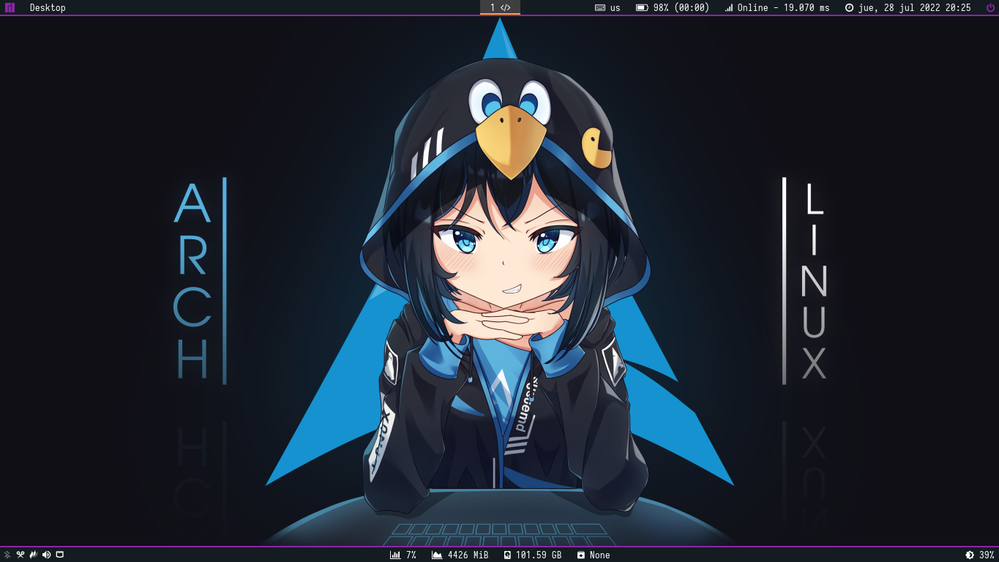
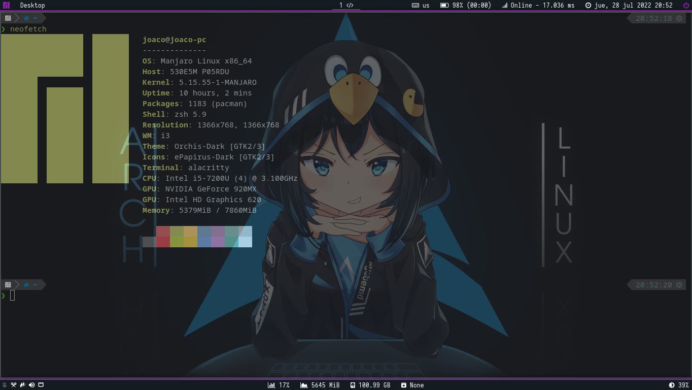

# Dotfiles

My dotfiles, I use a Manjaro distro with a Windows Manager environment with bars at the top and bottom, with Rofi as a program launcher and some keyboard shortcuts to control brightness, volume, music, etc. Also some command line aliases to improve my performance. And I use a laptop so I also use some scripts to save the battery.

## OS

- Manjaro Linux x86_64 (i3 Edition) - Arch Linux distro

## Order of dotfiles directories

```bash
/home/user
  ├── .config/ # Configuration files
  ├── Scripts/ # All Scripts of the system
  └── Wallpaper/
      ├── *.png / *.jpg # Wallpapers for lockscreen (randomly selected)
      └── background/
          ├── m1.png # Wallpaper for 1st monitor
          ├── m2.png # Wallpaper for 2nd monitor
          └── simple.png # Wallpaper simple for both monitor (or if the second is not connected)
```

## Desktop Package that I use

- i3gaps(i3wm) - Windows Manager
  - xprop - To know the class of a Windows
  - xorg-xev (or only xev) - To know the "name" of a key of the keyboard
  - xorg-input - To configure touchscreen
- betterlockscreen - Screen Lock
- xrandr - Configure Monitors
- rofi - Launcher and Windows Movement Assistant
- picom - Trasparency
- feh - Wallpaper Manager
- playerctl - Music control
- brightnessctl - Bright control
- polybar with polybar-themes(theme 'hack', with a few edited) - Bars
- dunst - Notification Manager
- Batsignal - Notification for low baterry

### Trays Icons

- Nm-applet - Network Manager Tray
- Volumen-icon - Volume Tray
- Udiskie - Automount disks
- Blueman-applet - Bluetooh Tray

## Themes / Confs

- Desktop - i3 Windows Manager
- Shell: Zsh
  - Oh-my-zsh (theme "powerlevel10k")
- Font - FiraCode Nerd Font (<https://github.com/ryanoasis/nerd-fonts/tree/master/patched-fonts/FiraCode>)
- Theme - Orchis-Dark (GKT and QT)
- Icons - ePapirus-Dark
- Cursor - Vimix Cursors
- Audio - ALSA and Pulseaudio

## Package and Tools

### Console / Terminal Commands

- Alacritty && Terminator - Terminal
- Bmenu - For some system tools
- Goto - Movement between directories in CLI (<https://github.com/Joacohbc/goto>)
- Ranger - CLI File Manager
- Xclip && Xsel - Clipboard
- Trash-cli - Trash in command line (<https://github.com/andreafrancia/trash-cli>)
- Neofetch - CLI System Information Tool
- Htop && Bashtop - Task Management
- Nethogs, Iftop, Termsharck && Wireshark-cli - Network Information Tools
- Vagrant - Virtualization
- Testdisk - Restore deleted files (<https://archlinux.org/packages/extra/x86_64/testdisk/>)
- Nano && Nvim - Console Editor
- Calc - Calculator command
- Xdotool - Simulate keyboard/mouse
- TLP && Powertop - Battery Savers
- Ventoy - Create a booteable USB
- 7z, gzip && xz - Zip manger
- UFW - IPTablas Manager (Firewall)

### Packages management

- Pacman - Package management
- Yay - Package management(for AUR packages)
- Pamac - Package Manager (GUI)
- aurutils - To use in scripts (AUR)

### GUI Tools

- Flameshot - Screenshots
- Vivaldi & Google Chrome- Browsers
- Copyq - Clipboard Manager
- Nemo - File Manager
- VSCode - Text/Code Editor
  - My Font: FiraCode Nerd Font (<https://github.com/ryanoasis/nerd-fonts/tree/master/patched-fonts/FiraCode>)
- Github Desktop - GUI Git Manager
- VirtualBox (for Vagrant) - Virtualization
- Only Office && Google Docs - Documents Tools
- Okular - Tool for PDFs
- Pinta - Photos Tools
- VLC - Multimedia
- OBS Studio - Screen Recorder
- Shotcut - Video Editor
- Redshift - Nightlight
- Grub Customizer
- Gcolor2 - Color Picker
- Blueman-manager - Bluetooh Manager
- Timeshift - Backup & Restore
- Xarchiver - Zip Manager

## Githubs/Post/URL that I use configure My Linux

- <https://github.com/zbaylin/rofi-wifi-menu>
- <https://github.com/AriosJentu/i3-polybar-config/>
- <https://github.com/adi1090x/polybar-themes>
- <https://www.reddit.com/r/linux/comments/a4o03z/get_the_best_out_of_you_battery_on_linux/>
- <https://superuser.com/questions/959735/xrandr-to-set-display-to-use-single-monitor-even-if-you-have-another-monitor-co>
- <https://github.com/Jguer/yay/issues/772>
- <https://wiki.archlinux.org/title/List_of_applications>
- <https://www.google.com/search?q=Invalid%20blur%20method%20picom>
- <https://github.com/davatorium/rofi/issues/1009>
- <https://stsewd.dev/es/posts/neovim-installation-configuration/>
- <https://forum.archlabslinux.com/t/solved-polybar-mpd-module-limit-label-length/270/3>
- <https://github.com/polybar/polybar/issues/2177>
- <https://www.nerdfonts.com/cheat-sheet>
- <https://github.com/polybar/polybar/issues/763>
- <https://www.howtogeek.com/269509/how-to-run-two-or-more-terminal-commands-at-once-in-linux/>
- <https://noviello.it/es/como-matar-o-detener-un-proceso-en-linux/>
- <https://www.nerdfonts.com/cheat-sheet>
- <https://www.cyberciti.biz/tips/quickly-list-all-available-fonts.html> (fc-list command)
- <https://github.com/puxplaying/toolbox>

## Images




